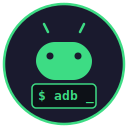

<p align="center">
  
</p>

<h1 align="center">Android ADB Skill</h1>

<p align="center">
  <a href="https://github.com/amit-nayar/android-adb-skill/actions/workflows/test.yml">
    
  </a>
  <br>
  Android device automation for AI coding agents.<br>
  Skill-driven orchestration with a local command layer instead of MCP.
</p>

## What is this?

This repo packages Android automation for agents in two layers:

- `./tools/android` is the shared execution surface.
- `skills/*/SKILL.md` are thin task workflows that compose the command layer.

The goal is to keep the agent experience high-level while keeping the runtime contract deterministic and testable.

The repo includes local tests plus GitHub Actions CI for the shared command layer.

## Why this shape?

The original MCP server solved the transport problem, but its useful part was really the command design: screenshots, UI dumps, element targeting, waits, installs, and logs. This repo keeps those capabilities while removing the extra server process.

Compared with a pure markdown skill pack, this structure is better because:

- skills stay short
- device handling is centralized
- text input escaping lives in one place
- UI parsing lives in one place
- agents can rely on `--json` instead of scraping prose

## Prerequisites

- Android SDK with `adb` on your PATH or `ANDROID_HOME` set
- `python3` on your PATH
- A connected Android device or running emulator

Quick check:

```bash
./tools/android device list --json
```

## Installation

### Codex

Copy these into your project root:

```bash
cp AGENTS.md /path/to/project/
cp -r docs /path/to/project/docs
cp -r skills /path/to/project/skills
cp -r tools /path/to/project/tools
```

Codex will read `AGENTS.md`, then use `docs/command-contract.md` plus the relevant skill file.

### Claude Code / Cursor / Copilot / other agents

Copy the same core folders:

```bash
cp -r docs /path/to/project/docs
cp -r skills /path/to/project/skills
cp -r tools /path/to/project/tools
```

Then add the agent-specific adapter file from this repo:

- `CLAUDE.md`
- `.cursor/rules/android-adb.mdc`
- `.github/copilot-instructions.md`
- `AGENTS.md` for agents that read a single root instructions file

## Command Layer

The shared execution interface is:

```bash
./tools/android ...
```

Prefer `--json` whenever the agent needs structured output.

Examples:

```bash
./tools/android device list --json
./tools/android screenshot --out /tmp/screen.png --json
./tools/android ui dump --json
./tools/android ui find --by text --value "Login" --json
./tools/android input tap-element --by text --value "Login" --json
./tools/android wait element --by text --value "Home" --json
./tools/android app install --apk ./app.apk --json
./tools/android debug logs --package com.example.app --level E --json
```

See [`docs/command-contract.md`](docs/command-contract.md) for the full contract.

## Testing

Run the local test suite with:

```bash
python3 -m unittest discover -s tests -v
```

CI runs the same suite on every push and pull request via [`.github/workflows/test.yml`](.github/workflows/test.yml).

The tests use fake `adb` and `emulator` binaries, so they do not require a real Android SDK or device on the CI runner.

## Skills

| Skill | Purpose |
|---|---|
| `android` | General orchestration |
| `android-screenshot` | Capture and inspect screenshots |
| `android-ui` | Dump and search the UI tree |
| `android-tap` | Tap elements or coordinates |
| `android-navigate` | Multi-step navigation with verification |
| `android-scroll` | Scroll to find off-screen elements |
| `android-gesture` | Swipe, long press, double tap |
| `android-test` | Run a test flow with evidence |
| `android-debug` | Collect logs and diagnose failures |
| `android-install` | Install and launch an APK |
| `android-device` | Device and emulator management |

## Example Usage

```text
/android open Settings and navigate to Privacy
/android-tap Login button
/android-test login with user@example.com and verify the home screen
/android-debug crashes in com.example.app after tapping Settings
```

## Repo Structure

```text
android-adb-skill/
├── tools/
│   └── android
├── docs/
│   └── command-contract.md
├── tests/
│   └── test_tools_android.py
├── skills/
│   ├── android/SKILL.md
│   ├── android-screenshot/SKILL.md
│   ├── android-ui/SKILL.md
│   ├── android-tap/SKILL.md
│   ├── android-navigate/SKILL.md
│   ├── android-scroll/SKILL.md
│   ├── android-gesture/SKILL.md
│   ├── android-test/SKILL.md
│   ├── android-debug/SKILL.md
│   ├── android-install/SKILL.md
│   └── android-device/SKILL.md
├── AGENTS.md
├── CLAUDE.md
├── .cursor/rules/android-adb.mdc
├── .github/copilot-instructions.md
├── .github/workflows/test.yml
└── README.md
```

## License

MIT
